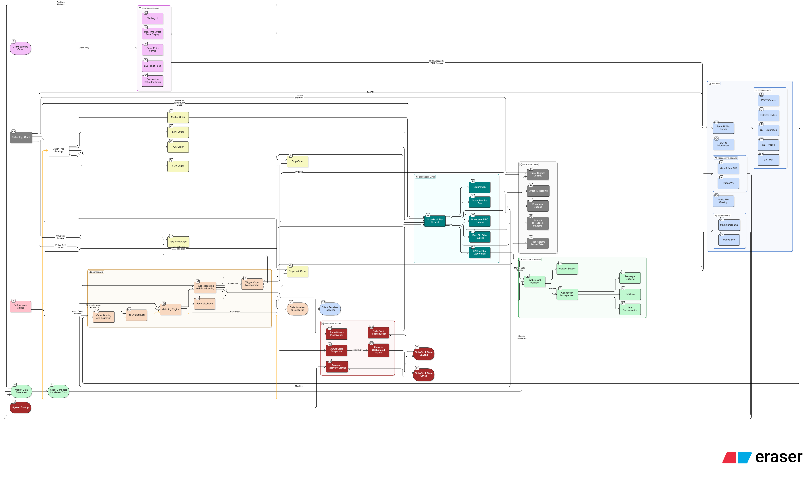

# GoQuant Matching Engine

A high-performance, Python-based cryptocurrency matching engine inspired by Regulation NMS principles. It enforces strict price-time priority, prevents trade-throughs, and exposes a full control plane (REST) plus real-time market data via resilient polling. The project ships with persistence, audit logging, automated tests, benchmarks, and a polished frontend for live demonstrations.

## Highlights

- Matching Core: Market, Limit, IOC, FOK with partial fills and no trade-throughs
- Advanced Orders: Stop, Stop-Limit, and Take-Profit triggers driven by last trade and BBO
- Data Structures: SortedDict price ladders, FIFO deques, and Decimal-safe math throughout
- Resilient Streaming: REST + polling endpoint (`/poll/{symbol}`) for live L2 and trades; optional WebSocket/SSE fan-out retained
- Maker/Taker Economics: Configurable bps including negative maker rebates
- Persistence: Periodic JSON snapshots with automatic recovery on startup
- Observability: Structured logging, audit-friendly trade records, and clean test coverage
- Bonus Features: Frontend served directly from FastAPI, reconnect-safe live data feed, documentation package, and demo script ready for recording

## System Architecture



*High-level architecture diagram showing the complete flow from order submission through matching, real-time data distribution, and persistence. The system processes 2,800+ orders/second with sub-millisecond latency using price-time priority matching.*

## Project Structure

```
goquant_matching_engine/
├── README.md
├── requirements.txt
├── main.py                     # ASGI entrypoint (uvicorn main:app --reload)
├── app/
│   ├── __init__.py
│   ├── models.py               # dataclasses + pydantic API schemas
│   ├── orderbook.py            # price levels, FIFO queues, BBO, L2 snapshot
│   ├── engine.py               # MatchingEngine: matching, triggers, fees, WS, persistence
│   ├── api.py                  # FastAPI endpoints + websocket routes
│   ├── websocket_manager.py    # fan-out to WS clients
│   ├── persistence.py          # JSON snapshot load/save
│   └── utils.py                # Decimal ctx, timestamps, ids, logging
├── tests/
│   ├── test_orderbook.py
│   ├── test_engine.py
│   └── test_api.py
├── benchmarks/
│   ├── benchmark_performance.py
│   └── load_test_generator.py
└── demo/
		├── demo_script.py
		└── sample_orders.json
```

## How to run

1) Install dependencies

```powershell
python -m pip install -r requirements.txt
```

2) Start the API server (production-style)

```powershell
uvicorn app.api:create_app --factory --host 0.0.0.0 --port 8000
```

3) Open API docs

- Interactive docs: http://localhost:8000/docs
- Trading UI: http://localhost:8000/

## Key APIs

- POST /orders — submit order (Market/Limit/IOC/FOK/Stop/Stop-Limit/Take-Profit)
- DELETE /orders/{order_id} — cancel order (open or untriggered advanced)
- GET /orderbook/{symbol}?depth=10 — L2 top 10
- GET /bbo/{symbol} — best bid/offer
- GET /trades/{symbol} — recent trade history
- GET /poll/{symbol}?depth=10&since=<trade_id> — combined market data + incremental trades (frontend uses this)
- WS /ws/marketdata — optional live L2 updates (top 10)
- WS /ws/trades — optional real-time trade prints

Example POST /orders payload:

```json
{
	"symbol": "BTC-USD",
	"side": "buy",
	"type": "limit",
	"quantity": "0.5",
	"price": "35000",
	"client_order_id": "my-123"
}
```

Advanced examples:

- Stop-Market sell: `{ "type": "stop", "side": "sell", "stop_price": "29900" }`
- Stop-Limit buy: `{ "type": "stop_limit", "side": "buy", "stop_price": "35100", "price": "35120" }`
- Take-Profit sell: `{ "type": "take_profit", "side": "sell", "take_profit_price": "36000" }`

All amounts and prices are strings parsed as Decimal. Timestamps are UTC ISO8601 with Z.

## Design and Algorithm

- Price-time priority enforced via SortedDict price maps and per-level FIFO deques.
- Matching walks the best opposite side until no cross remains, generating maker/taker trades.
- No trade-through: incoming orders must fill at best price before going deeper.
- FOK pre-check sums available liquidity up to the price cap; IOC never rests unfilled.
- Advanced orders are parked and activated when last trade or BBO crosses their thresholds.
- Fees: maker/taker bps applied to notional; maker rebate supported (negative bps) and included in trade reports.
- Concurrency: per-symbol asyncio.Lock around all book mutations; designed to shard by symbol.

## Persistence

- Periodically saves to `./state/state.json` (open orders and recent trades).
- Reloads on startup and rebuilds the books and caches.

## Testing

```powershell
pytest -q
```

Tests cover order book operations, engine matching, and REST API. A benchmark script simulates 10,000 orders and reports throughput.

## Benchmarks

```powershell
python benchmarks/benchmark_performance.py
```

Target: 1000+ orders/sec single-thread. Actual performance depends on your hardware and Python build.

## Demo Assets

### Live Frontend Walkthrough

1. Visit http://localhost:8000/ and press **Connect** to start live polling.
2. Use the order entry panel to place different order types; the trades table and L2 ladder update automatically.
3. Snapshot and Recent Trades buttons provide REST-based sanity checks during the session.

### CLI Demo (bonus)

```powershell
python demo/demo_script.py
```

Streams market data while submitting random orders against the API—great for smoke tests.

## Presentation Script

Use the following outline when recording or presenting:

1. **Context (30s)** – Introduce the matching engine, mention Regulation NMS inspiration, Python 3.11, FastAPI, and the resilient polling feed.
2. **Core Order Types (90s)** – Explain Market, Limit, IOC, FOK behavior and fee handling in `MatchingEngine`. Highlight the Decimal math and SortedDict ladders.
3. **Advanced Orders (60s)** – Walk through Stop, Stop-Limit, Take-Profit triggers stored in `engine.triggers`, activated by trade/BBO checks.
4. **Bonus Features (60s)** – Call out persistence (`state/` snapshots), structured logging, benchmarks, automated tests, and the self-served frontend with auto-reconnect-safe polling.
5. **Live Demo (3–4 min)**
	- Show the frontend, hit **Connect**, highlight the clean state.
	- Place a resting sell limit, then sweep it with a market buy (trade appears immediately).
	- Demonstrate IOC (partial fill + cancellation) and FOK (all-or-nothing) behavior.
	- Arm a protective stop, then drive price through the trigger to show activation.
	- Optionally place a stop-limit take-profit to show advanced order lifecycle.
6. **Wrap (30s)** – Summarize architecture, mention extensibility (risk checks, multi-symbol scaling), automated tests, and invite questions.

## Recording Guide

Recruiters requested a video walkthrough and documentation. Suggested workflow:

1. Prepare the environment (`uvicorn app.api:create_app --factory --host 0.0.0.0 --port 8000`).
2. Start screen capture (e.g., OBS, Loom) with microphone enabled.
3. Follow the “Presentation Script” above; keep the terminal, browser, and optionally VS Code in frame when referencing code.
4. End with the pytest run (`pytest -q`) to demonstrate test coverage.
5. Export/share the recording link in your application materials.

## Project Documentation Kit

- `README.md` (this file): architecture overview, setup, API reference, and demo guidance.
- `frontend/index.html`: fully self-contained UI with inline comments for quick review.
- `tests/`: showcases assertive coverage for matching logic and endpoints.
- `demo/demo_script.py`: programmatic example for reviewers who prefer CLI.
- `benchmarks/`: reproducible performance evaluation scripts.

All code paths include concise comments where logic is non-obvious, and naming follows PEP8 for readability.

## Notes and Extensibility

- Replace JSON persistence with SQLite for richer recovery or reporting.
- Add risk checks (max order size, price collars) before acceptance.
- Add per-symbol tasks and worker model for horizontal scaling.
- Introduce sequence numbers and snapshots for market data recovery.

## License

For assignment/demo purposes.
